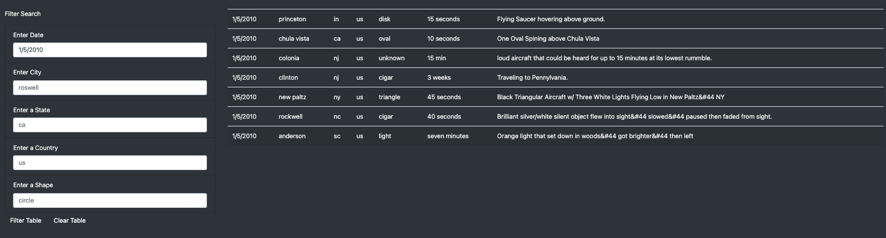
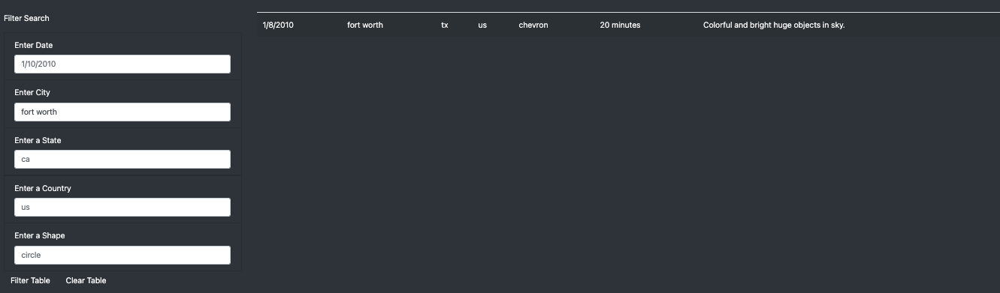
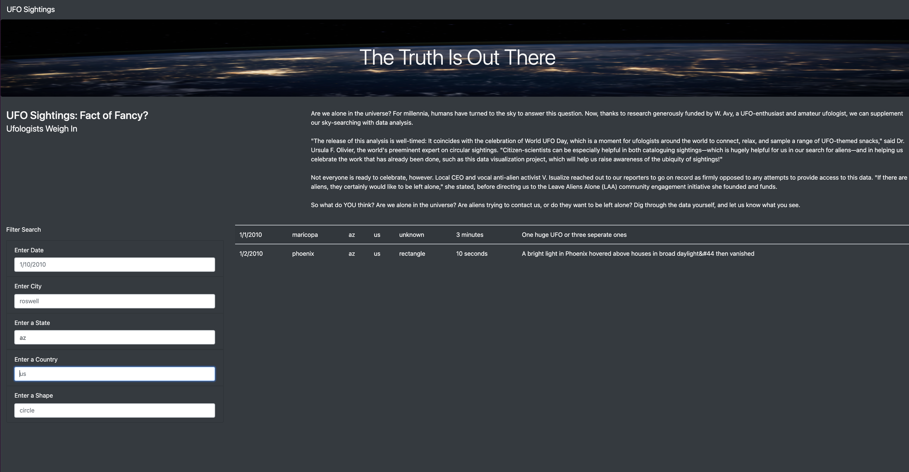
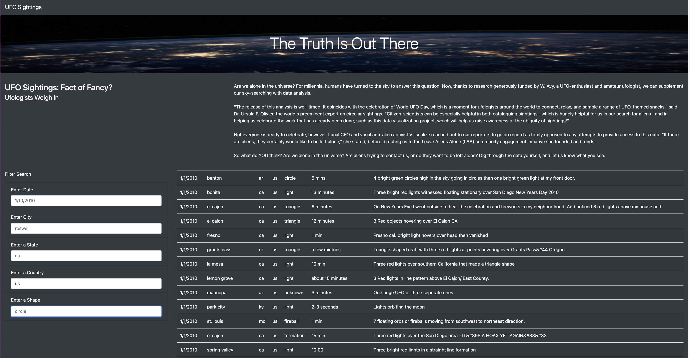
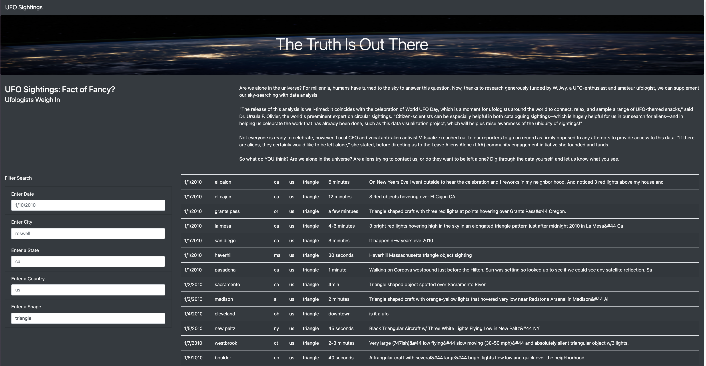
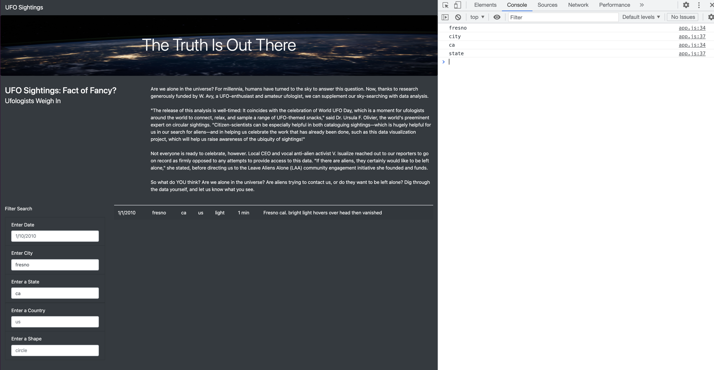

# UFOS

## Overview
Amazing Prime Video was a platform for streaming movies and TV shows on Amazing Prime, the world's largest online retailer.  The Amazing Prime video team would like to develop an algorithm to predict which low budget movies being released will become popular so that they can buy the streaming rights at a bargain.  To inspire the team, have some fun, and connect with the local coding community, Amazing Prime has decided to sponsor a hackathon.  Providing a clean data set of movie data and asking participants to predict the popular pictures. 

Britta, a member of the Amazing Prime video team, has been tasked with creating the datasets for the hackathon.  There are two data sources: a scrape of Wikipedia for all movies released since 1990, and rating data from the Movie Land's website.  She'll need to extract the data from the two sources, transform it into one clean data set, and finally load that data set into a SQL table. 

My job is to assist Britta in creating these data sets and loading the SQL Table.

Dana’s webpage and dynamic table are working as intended, but she’d like to provide a more in-depth analysis of UFO sightings by allowing users to filter for multiple criteria at the same time. In addition to the date, you’ll add table filters for the city, state, country, and shape.

## Resources
* Data Sources: data.js, nasa.jpg
* Software: Visual Basic Studio, JavaScript, Bootstrap 4.0.0, HTML5, CSS

### RESULTS

## Search Criteria Process

**Index Page**
This is the applications startup page.  The user can re-initialize the page by either choosing the "UFO Sighting" box in the upper left corner, or by just refreshing the page in the Chrome browser.   This will reset all of the _Filter Search_ criteria to the 'default' setting examples and display the entire table of UFO sightings available.

The user is presented with the applications web-page with our opening banner of "The Truth Is Out There".  We also provide a question of "UFO Sightings: Fact or Fancy?"  We present some comments from Ufologists, to the user and ask the user what do they think?

Now the user has an opportunity to search the data to see UFO sightings that have been reported.

We offer searching by a single or multiple criteria. The options are Date, City, State, Country and Shape (of UFO).  You can also search more than 1 of these criteria.

## Filter By Date

To filter by date, the users enters the date, in the format of '1/10/2010' - as presented in the box as an example, and either clicks another filter box, or hits enter. The results will show as below.  The date entered was 1/5/2010 for the following results:

## Filter By City

## Filter By State

## Filter By US

## Filter By Shape

## Filter By City and State

### Summary

This overall project was definitally a learning experience as the regular expressions were put to the test since there was a great deal of differences in several of the columns.  The iterative process of breaking down the transform step into evaluating one column at a time, and then each data set at a time, definitely helped with the ability to look at the data in pieces.  The reuse of _function_ **extract_transform_load(wiki,kaggle,ratings)** really helped in seeing how we could repeat the use of a function for multiple data sets.
The exercise of evaluating Wikipedia vs MovieLens was what I found most helpful when working through the columns, and making the following chart before we even started creating any functions:

Just that bit of sitting down and going through each data set, helped slow down the process into steps for me to know how to go forward.

Jill Hughes
