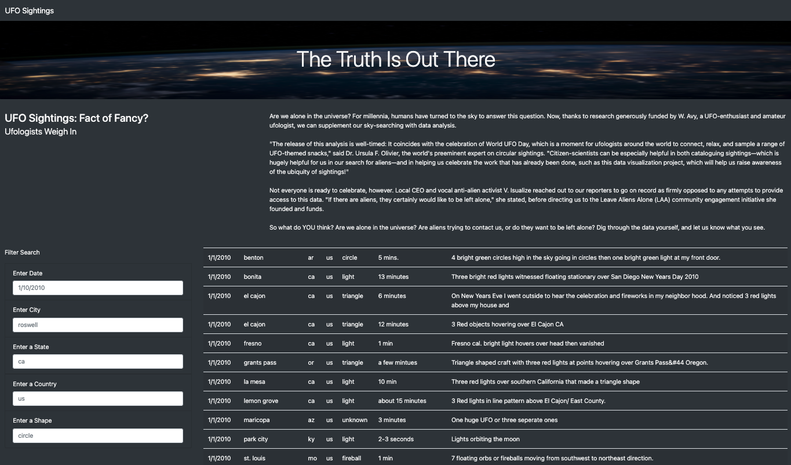
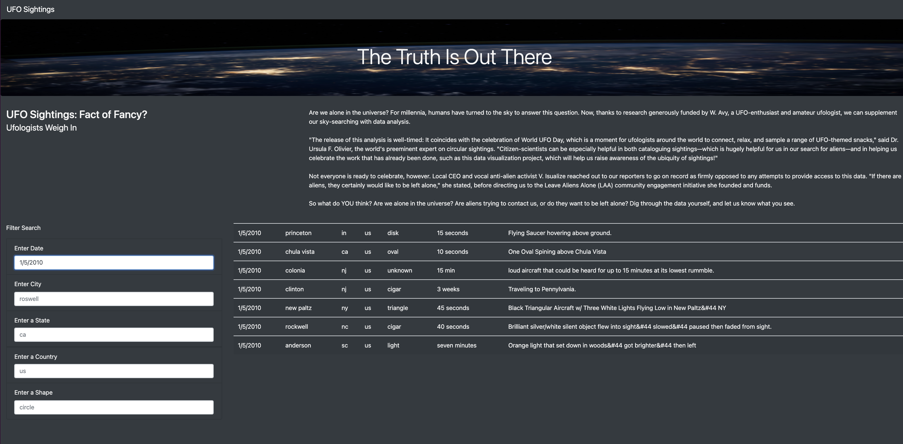
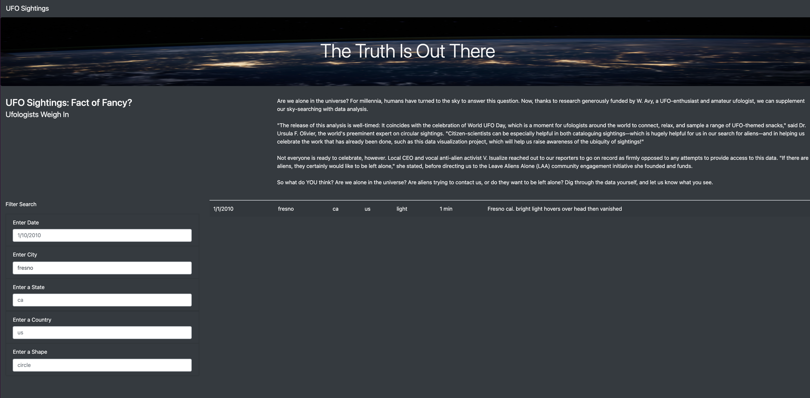

# UFOS

## Overview

This project was an introduction to JavaScript incorporating HTML5, CSS and Bootstrap, in order to create a dynamic webpage that allowed user input.  The topic to design around was UFO Sightings and we were given a dataset within a data.js file to use.

The application was to present the user the ability to search the "UFO Sightings" and filter the data by date, city, state, country, shape or a combination of any of those.

## Resources
* Data Sources: data.js, nasa.jpg
* Software: Visual Basic Studio, JavaScript, Bootstrap 4.0.0, HTML5, CSS

### RESULTS

## Search Criteria Process

**Index Page**
This is the applications startup page.  The user can re-initialize the page by either choosing the "UFO Sighting" box in the upper left corner, or by just refreshing the page in the Chrome browser.   This will reset all of the _Filter Search_ criteria to the 'default' setting examples and display the entire table of UFO sightings available.

The user is presented with the applications web-page with our opening banner of "The Truth Is Out There".  We also provide a question of "UFO Sightings: Fact or Fancy?"  We present some comments from Ufologists, to the user and ask the user what do they think?

Now the user has an opportunity to search the data to see UFO sightings that have been reported.

We offer searching by a single or multiple criteria. The options are Date, City, State, Country and Shape (of UFO).  You can also search more than 1 of these criteria.

## Filter By Date

To filter by date, the user enters the date, in the format of '1/10/2010' - as presented in the box as an example, and either clicks another filter box, or hits enter. The results will show as below.  The date entered was 1/5/2010 for the following results:

## Filter By City

To filter by city, the user enters the city, the example is shown as 'roswell', and again, either clicks another filter box, or hits enter.  The results will show up in the window after the mouse click, or enter is chosen.  The data entered was fresno for the following results:

## Filter By State

To filter by state, the user enters the state, the example is shown as 'ca', and again, either clicks another filter box, or hits enter.  The results will show up in the window after the mouse click, or enter is chosen.  The data entered was ca for the following results:

## Filter By Country

To filter by country, the user enters the country code, the example is shown as 'us', and again, either clicks another filter box, or hits enter.  The results will show up in the window after the mouse click, or enter is chosen.  The data entered was us for the following results:

## Filter By Shape

To filter by shape, the user enters the shape of the ufo, the example is shown as 'circle', and again, either clicks another filter box, or hits enter.  The results will show up in the window after the mouse click, or enter is chosen.  The data entered was triangle for the following results:

## Filter By more than 1 area

To filter by more than 1 criteria, the user enters the data into more than one field, using the examples as a guide. The results will show up in the window after the mouse click, or enter is chosen.  The data entered was city = 'fresno' and state = 'ca' for the following results:  _Note:_ I have included the development window to show the console.log to show that more than 1 filter object was chosen.

### Summary

This project was a great learning experience and the module work was easy to follow along and progress to get to the end result, with buttons to run the application and clear the filters.  

Once going into the challenge, to remove these buttons and allow the application to dynamically work once a mouse click chose a text field, or a user hit enter, and removed all buttons, was definitely an advanced step for me to see how to eliminiate all of my steps and variables into an object and let it determine what was happening.  But this method did make for a streamlined application, clean code and an application that is very responsive to the users input, immediately upon a keystroke, so that was very cool to see.

A few things I would like to add to this application:
* One would be to put back the "clear button" I had during the module work.  That really helped in resetting my filters when I wanted to change out some values.  I was testing and chose a state, then a city and and then another city - and I ended up with a combination of 2 different cities in my filter.  The last city was of course the one that "won" the fight - but both showed up in my console.log as still in the object.
* The other would be a drop down menu for the text boxes, it was hard to determine what dates, cities, states, countries or shapes were available to you.  So as to not enter something incorrectly, a drop down menu of "unique" values in those columns, would be a preferred way to choose what to search for easier.

Jill Hughes
